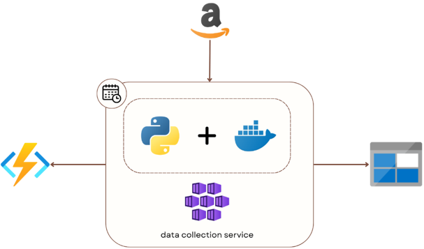
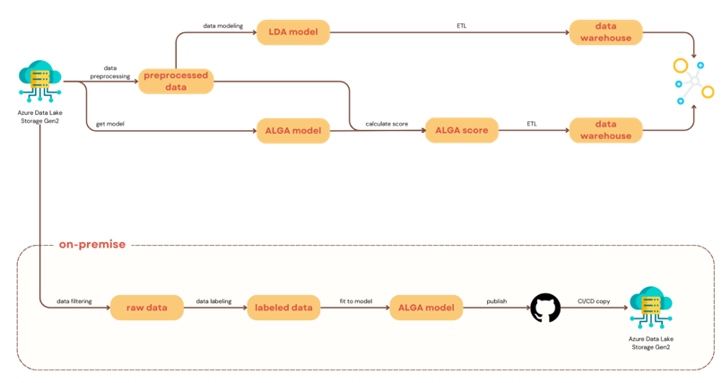
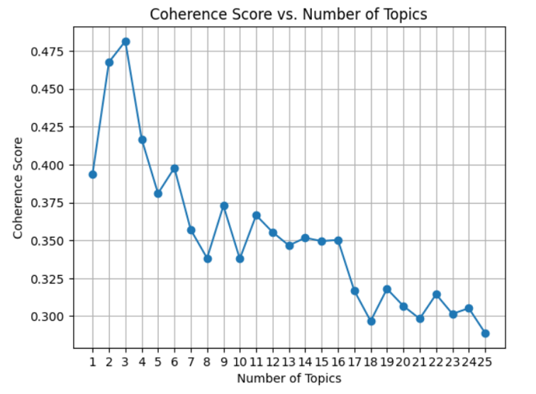
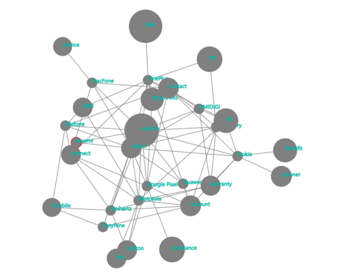

# Dual-Approach Big Data Analytics for Topic Discovery and Complaint Analysis in Smartphone Reviews

## Project Overview

This project focuses on **Big Data Analytics** by leveraging two primary methods for analyzing customer feedback on smartphones: **Topic Discovery** using Latent Dirichlet Allocation (LDA) and **Complaint Sentiment Analysis** using a Lexicon-based model. The data is sourced from **Amazon reviews** of smartphones, and the analysis is conducted using **PySpark** on **Microsoft Azure**.

---

## Team Members
- Trần Hoàng Anh (K214162143)
- Lê Quốc Dân An (K214162140)
- Cao Nguyễn Hải Như (K214162148)
- Trần Thị Minh Hiền (K214160989)

---

## Table of Contents

1. [Technologies Used](#technologies-used)
2. [Architecture](#architecture)
3. [Data Collection](#data-collection)
4. [Modeling](#modeling)
5. [Experimental Results](#experimental-results)
6. [Conclusion](#conclusion)

---

## Technologies Used
- **Apache Spark**: For in-memory distributed data processing.
- **Microsoft Azure**: Cloud infrastructure, including Data Lake and Synapse Analytics.
- **PySpark**: For implementing and running LDA models.
- **Latent Dirichlet Allocation (LDA)**: Topic modeling to identify key themes in customer complaints.
- **Lexicon-based Sentiment Analysis**: To assess customer sentiment in reviews.

---

## Architecture

The architecture consists of four main components:
1. **Data Source Layer**: Collecting raw Amazon customer reviews.
2. **Data Collection Layer**: Using Azure Functions and Docker containers to scrape and store data.
3. **Data Storage Layer**: Storing data in Azure Data Lake Storage Gen2 in semi-structured formats like Parquet.
4. **Data Analysis Layer**: Performing LDA-based topic modeling and Lexicon-based sentiment analysis.

---

## Data Collection

Data is collected from Amazon reviews using a combination of Python scripts, APIs, and web scraping techniques. The data includes fields such as:
- **Product ID**
- **Comment title**
- **Author**
- **Rating**
- **Timestamp**
- **Product attributes**
  
The data is stored in **Azure Blob Storage** for further processing.

### Figure: Data Collection Layer

---

## Modeling

In this project, the **Lexicon-Based Sentiment Analysis** follows a **double approach** where the local phase is used to optimize the lexicon dictionary, and the cloud phase handles both **Latent Dirichlet Allocation (LDA)** and **Sentiment Analysis** on the customer reviews.

### 1. Local Processing: Lexicon Dictionary Optimization

- **Lexicon Dictionary Optimization**: The local phase focuses solely on optimizing the **sentiment lexicon**. This involves fine-tuning the dictionary by adding, removing, or adjusting words and their sentiment scores to better reflect the nuances in smartphone reviews.
- **Manual Adjustments**: During this phase, domain-specific terms (such as technical jargon related to smartphones) are manually curated and assigned appropriate sentiment values.
- **Deployment to Cloud**: Once the lexicon has been optimized, the updated dictionary is uploaded to the cloud server, where it will be used for large-scale sentiment analysis.

### 2. Cloud Processing: LDA and Sentiment Analysis

The **cloud phase** handles the bulk of the processing, including both **topic modeling** with LDA and **aspect-based sentiment analysis**:

- **Latent Dirichlet Allocation (LDA)**: In the cloud, LDA is applied to identify key topics in the customer reviews (e.g., battery life, camera quality, connectivity). The topics provide a structured breakdown of the feedback, enabling aspect-specific sentiment analysis.
  
- **Sentiment Analysis**: Using the optimized lexicon dictionary from the local phase, the sentiment of each review is analyzed. This involves scoring each aspect of the product based on the pre-defined lexicon. For example, sentiment scores are calculated for aspects such as battery, camera, and SIM card issues.

- **Data Aggregation and Storage**: After sentiment analysis, the results (aspect-based sentiment scores) are aggregated and stored in **Azure Data Lake** for further analysis.

- **Visualization**: Tools like **Power BI** are used to visualize the aggregated results, showing trends and insights into customer sentiment for different smartphone brands and features.

### Workflow Summary:

1. **Local Phase**:
   - Optimize the **lexicon dictionary** for sentiment analysis.
   - Upload the optimized dictionary to the cloud.

2. **Cloud Phase**:
   - Perform **LDA** to discover topics.
   - Apply **Lexicon-Based Sentiment Analysis** on the reviews using the optimized dictionary.
   - Store results in **Azure Data Lake**.
   - Visualize data using **Power BI**.

**Table Example**:

| Topic      | Brand       | Sentiment Score |
|------------|-------------|-----------------|
| Battery    | Google      | -0.67           |
| Camera     | Apple       | 0.45            |
| SIM Issue  | Verizon     | -0.82           |

This **double approach** ensures that the lexicon dictionary is precisely optimized in the local phase while leveraging cloud infrastructure for scalable sentiment analysis and topic discovery.

---

## Experimental Results

The LDA model identified three primary topics from the reviews:
1. **Product Functionality**: Issues related to product compatibility and performance.
2. **Pricing Satisfaction**: Discussions about the value and pricing of smartphones.
3. **Technical Concerns**: Problems with features like SIM cards and camera quality.

**Figure: LDA Coherence Score for Topics**

For the Lexicon-based sentiment model, the major complaints were related to:
- **Battery Life**
- **SIM Card Issues**
- **Camera Performance**

**Figure: Complaint Topics by Brands**

---

## Conclusion

This project demonstrates the application of **Big Data techniques** for analyzing customer feedback using both topic modeling and sentiment analysis. The combination of **PySpark**, **Azure**, and the LDA model provided meaningful insights into smartphone user complaints, helping businesses better understand customer concerns.

---

## Future Work

- Expanding the dataset beyond Amazon reviews.
- Exploring other sentiment analysis techniques like **neural networks**.
- Automating more stages of data processing and analysis.

---

## License

This project is licensed under the MIT License - see the [LICENSE](LICENSE) file for details.
